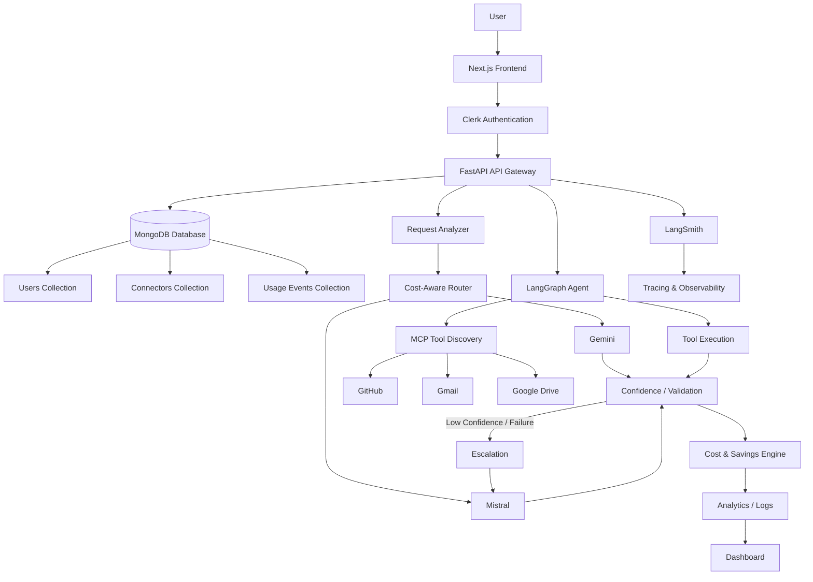

# 💰 Cost-Aware Multi-Model Router

> **Intelligent Multi-Model AI Routing Platform that dynamically selects the most cost-efficient capable model, executes MCP-powered tools, escalates when necessary, and provides real-time cost, confidence, savings, and observability analytics.**

---

## 📸 Architectural Overview



---

## 🛠 What Does It Do?

The **Cost-Aware Multi-Model Router** is an enterprise-ready AI orchestration platform designed to eliminate unnecessary LLM spending while maintaining optimal response accuracy and output quality. Rather than blindly forwarding every query to a single top-tier model, the platform dynamically evaluates, routes, validates, and escalates incoming user requests across a multi-model ecosystem powered by **Gemini** and **Mistral**.

### End-to-End Workflow

1. **Natural-Language Input**: The user submits a request via the Next.js frontend or direct REST API endpoint.
2. **Request & Complexity Analysis**: The system classifies the request (e.g., classification, extraction, summarization, Q&A) and calculates a complexity score based on input length, task type, structure, and reasoning requirements.
3. **Dynamic Model Routing**: The cost-aware router determines whether the request can be handled by a lightweight, low-cost model (**Gemini 2.0 Flash**) or requires a high-capability model (**Mistral Small / Medium**).
4. **Primary Execution**: Suitable low-cost or low-to-medium complexity requests are dispatched first to **Gemini**.
5. **Conditional Fallback & Escalation**: If Gemini encounters a rate limit, provider error, or fails confidence validation, the system escalates execution to **Mistral**.
6. **Response Validation & Confidence Scoring**: Outputs undergo schema validation and confidence scoring against deterministic metrics (structural integrity, completeness, and hallucination heuristics).
7. **Dynamic MCP Tool Discovery**: When external actions or context are required, the router triggers tool discovery via Model Context Protocol (MCP).
8. **Integrated Service Connectors**: The engine dynamically selects and invokes appropriate user-scoped connectors for **GitHub**, **Gmail**, and **Google Drive**.
9. **Multi-Step Agent Orchestration**: Complex tool-using workflows execute inside a LangGraph state machine following a **Plan → Validate → Select Tool → Execute → Observe → Replan** cycle.
10. **Token & Cost Accounting**: Every request tracks exact or estimated input/output token counts and calculates real-time execution costs.
11. **Baseline & Savings Engine**: The platform calculates what the request *would* have cost on a baseline top-tier model, producing non-negative savings metrics (`max(0, baseline - actual)`).
12. **Analytics Dashboard**: Aggregated operational KPIs, total model usage, financial savings, confidence distributions, and request history are rendered on the analytics dashboard.
13. **LangSmith Observability**: Complete execution graphs, prompt payloads, model responses, tool calls, and latency distributions are traced and logged via LangSmith integration.

> **Crucial Design Philosophy**: The primary goal is **not** to simply choose the cheapest model at all costs. The platform intelligently balances **Cost, Capability, Complexity, Confidence, Response Validity, Tool Requirements, and Escalation Criteria** to deliver high reliability at minimal price per query.

---

## 🚨 Problem Statement

Deploying production AI systems powered exclusively by top-tier LLMs leads to significant financial inefficiency and operational friction:

- **Unnecessary Model Spending**: Up to 70% of production LLM traffic consists of simple queries (e.g., formatting, entity extraction, short Q&A) that do not require expensive frontier models.
- **Static & Dumb Routing**: Applications typically hardcode model selections per endpoint, preventing dynamic optimization based on live input complexity or provider health.
- **Zero Cost & Savings Visibility**: Engineering teams lack granular per-request metrics showing baseline vs. actual model cost, making ROI calculations difficult.
- **Lack of Confidence-Based Escalation**: Rigid pipelines either accept low-quality outputs from cheap models or overpay for every request to ensure accuracy.
- **Fragile External Tool Integrations**: Custom API integrations break easily and lack standard interfaces for tool registration and capability discovery.
- **Unscoped Connector Management**: External integrations (e.g., reading emails or repository metadata) are often global or poorly isolated across user contexts.
- **Black-Box Agent Workflows**: Multi-step AI agents frequently fail in hidden loops without clear step-by-step trace logs or inspection capabilities.

Building a **cost-aware, self-healing routing layer** is essential for scaling production AI applications reliably without ballooning infrastructure costs.

---

## 💡 Solution

The **Cost-Aware Multi-Model Router** addresses these challenges through a modular, decoupled architecture:

### 🎯 Intelligent Model Routing
Analyzes incoming prompt metrics, intent structure, and complexity scores to select the most economical capable model. Simple summarization and extraction tasks default to Gemini 2.0 Flash, preserving budget without sacrificing output quality.

### 💰 Real-Time Cost Optimization Engine
Tracks precise input and output token consumption for every request. Computes actual execution cost against a configurable baseline model (e.g., pure Mistral / high-tier model execution) to quantify exact financial savings.

### 🛡 Confidence-Based Escalation
Enforces strict Pydantic output validation and heuristic confidence thresholding. If a low-cost model response fails validation or scores below configured thresholds, the system transparently escalates the prompt to a higher-capability fallback model.

### 🔌 Dynamic MCP Tool Integration
Employs the Model Context Protocol (MCP) standard to discover and expose tools dynamically to the LLM agent, avoiding brittle hardcoded integrations.

### 🔄 Multi-Step Agent Execution (LangGraph)
Implements an iterative loop (**Plan → Validate → Select Tool → Execute → Observe → Replan**) powered by LangGraph, enabling autonomous multi-step task execution with full state control.

### 👤 User-Scoped Connectors
Binds connector authorization and state (GitHub, Gmail, Google Drive) to the authenticated Clerk user identity, ensuring isolated, secure user-level tool access.

### 🔍 End-to-End Tracing & Observability
Integrates LangSmith for deep operational tracing, allowing developers to inspect prompt inputs, latency profiles, node traversals, tool calls, and error stack traces in real time.

### 📊 Comprehensive Analytics & KPI Dashboard
Exposes actionable business and operational metrics via API endpoints and frontend dashboards:
- Total Request Count & Throughput
- Model Usage Breakdown (Gemini vs. Mistral)
- Actual Cost vs. Baseline Cost
- Net Financial Savings ($) & Savings Percentage (%)
- Confidence Score Distributions & Escalation Frequencies
- Tool Execution Counts & Provider Failure / Rate-Limit Rates

---

## 🗄️ MongoDB Persistence & Security Architecture

The platform integrates **MongoDB** as its persistent application database layer, working seamlessly alongside **Clerk Authentication**:

- **Clerk**: Authentication & Identity Provider (manages user credentials, issues JWTs, verifies sessions).
- **MongoDB**: Application Data & Persistence Layer (stores application user profiles, preferences, connector states, usage events, and cost analytics).

```
User
 ↓
Clerk Authentication (JWT Verification via PyJWKClient)
 ↓
FastAPI Backend (Extracts verified clerk_user_id)
 ↓
MongoDB Database Layer
 ├── Users Collection (clerk_user_id, email, name, routing preferences)
 ├── Connectors Collection (clerk_user_id, provider, status, account metadata)
 └── Usage Events Collection (request_id, clerk_user_id, model, cost, savings)
```

### MongoDB Collections Schema

1. **`users` Collection**:
   - **Purpose**: Application-level user details and routing preferences associated with Clerk users.
   - **Unique Index**: `clerk_user_id` (UNIQUE)
   - **Fields**: `clerk_user_id`, `email`, `first_name`, `last_name`, `full_name`, `image_url`, `created_at`, `updated_at`, `last_login_at`, `preferences` (`default_model`, `confidence_threshold`, `complexity_threshold`).
   - **Security**: Never stores passwords, Clerk secret keys, or authentication secrets.

2. **`connectors` Collection**:
   - **Purpose**: User-scoped connector connection status and account metadata for MCP tools (GitHub, Gmail, Google Drive).
   - **Unique Compound Index**: `(clerk_user_id, provider)` (UNIQUE)
   - **Fields**: `clerk_user_id`, `provider`, `status` ("connected"/"disconnected"), `connected_at`, `updated_at`, `metadata`.
   - **Security**: OAuth access and refresh tokens are never stored in plain text or returned to the frontend.

3. **`usage_events` Collection**:
   - **Purpose**: Persisted request history, model routing logs, token usage, cost accounting, and savings analytics.
   - **Indexes**: `(clerk_user_id, created_at)`, `request_id`
   - **Fields**: `request_id`, `clerk_user_id`, `model`, `status`, `confidence`, `escalated`, `escalation_reason`, `input_tokens`, `output_tokens`, `actual_cost`, `baseline_cost`, `savings`, `savings_percentage`, `tools_used`, `created_at`.

### Security Architecture

- **Backend Identity Resolution**: The frontend never dictates user identity for database operations. All queries extract `clerk_user_id` strictly from verified Clerk JWT tokens decoded server-side via `PyJWKClient`.
- **Strict User Isolation**: Every database query on `users`, `connectors`, and `usage_events` is scoped by `clerk_user_id`. User A can never access or modify User B's connector states or cost analytics.
- **Credential Protection**: MongoDB connection details (`MONGODB_URI`) are kept strictly in server-side environment variables and are never exposed to Next.js or `NEXT_PUBLIC_*` variables.
- **Graceful Fault Tolerance**: Database connection managers utilize connection pooling with timeouts and connection health checks (`/health` endpoint). If MongoDB is temporarily unavailable, fallback mechanisms prevent backend crashes.

---

## ✨ Key Features

- **Cost-Aware LLM Routing**: Real-time evaluation of prompt complexity to route requests dynamically.
- **Gemini + Mistral Multi-Model Core**: Seamless support for `gemini-2.0-flash` (low cost) and `mistral-small-latest` (high capability / fallback).
- **Confidence-Based Escalation**: Automated escalation to secondary models when primary outputs fail validation or threshold tests.
- **Structured Response Validation**: Robust Pydantic schema validation for structured outputs.
- **MCP Dynamic Tool Discovery**: Transport-agnostic tool registration and discovery via Model Context Protocol.
- **GitHub Integration**: Discover and interact with repository structures, code files, and issues via MCP connectors.
- **Gmail Integration**: Inspect inbox messages, draft responses, and perform user-scoped email tasks.
- **Google Drive Integration**: Query, list, and read document metadata securely within user permissions.
- **Multi-Step Agent Orchestration**: Stateful agent loop powered by LangGraph for multi-turn task resolution.
- **User-Scoped Connector State**: Multi-tenant isolation binding connector tools to authenticated Clerk users.
- **Clerk Authentication**: Enterprise user authentication, JWT verification, and session management.
- **FastAPI Backend Gateway**: High-performance asynchronous REST API backend with CORS, middleware, and dependency injection.
- **Next.js + React + TypeScript Frontend**: Modern, responsive dashboard interface with interactive model controls and analytics visualizations.
- **Cost & Savings Analytics Engine**: Token-level accounting calculating actual cost, baseline cost, and non-negative savings.
- **LangSmith Tracing**: Full execution graph tracing, node timing, and prompt debugging.
- **Structured API Standards**: Unified request/response formats with explicit error handling and status metadata.
- **Provider Failure & Rate-Limit Handling**: Graceful fallback strategies during upstream LLM outages or rate limits.
- **Request Traceability**: Unique request IDs attached to all logs, events, and LangSmith traces.
- **Streamlit & Next.js Analytics**: Dual dashboard capabilities for rapid prototyping and production analytics.

---

## 🏗 Technology Stack

| Layer | Technologies |
| :--- | :--- |
| **Frontend UI** | Next.js (App Router), React, TypeScript, Tailwind CSS, Lucide Icons, Streamlit |
| **Backend API Gateway** | Python 3.10+, FastAPI, Uvicorn, Pydantic v2, Starlette Middleware |
| **AI Orchestration & Routing** | LangChain, LangGraph, Python `mcp` SDK |
| **LLM Provider Models** | Google Gemini (`gemini-2.0-flash`), Mistral AI (`mistral-small-latest`) |
| **Tool Protocols & Connectors** | Model Context Protocol (MCP), GitHub Connector, Gmail Connector, Google Drive Connector |
| **Authentication & Security** | Clerk Authentication, JWT Bearer Token Verification, Session Management |
| **Observability & Logging** | LangSmith Tracing, JSONL Structured Event Logging |
| **Testing & Quality Assurance** | Pytest, Python Unittest |

---

## 🚀 Getting Started

### Prerequisites

- **Python**: 3.10 or higher
- **Node.js**: v18+ and `npm` (for the Next.js frontend)
- **API Keys**:
  - `GOOGLE_API_KEY` (Gemini API)
  - `MISTRAL_API_KEY` (Mistral API)
  - `LANGSMITH_API_KEY` (Optional for tracing)
  - `NEXT_PUBLIC_CLERK_PUBLISHABLE_KEY` & `CLERK_SECRET_KEY` (For authentication)

### 1. Repository Setup

```powershell
# Clone or navigate to the repository directory
cd K:\multi_model\PROJECT_04_COST_AWARE_ROUTER

# Create and activate a Python virtual environment
python -m venv .venv
.\.venv\Scripts\Activate.ps1

# Install backend dependencies
pip install -r requirements.txt
```

### 2. Environment Configuration

Create a `.env` file in `PROJECT_04_COST_AWARE_ROUTER/` based on the following environment variable structure:

```ini
# LLM Provider API Keys
GOOGLE_API_KEY=your_google_gemini_api_key
MISTRAL_API_KEY=your_mistral_api_key

# Model Configuration
GEMINI_MODEL=gemini-2.0-flash
MISTRAL_MODEL=mistral-small-latest

# Pricing Defaults (Price per 1M tokens)
GEMINI_INPUT_PRICE=0.000001
GEMINI_OUTPUT_PRICE=0.000005
MISTRAL_INPUT_PRICE=0.000003
MISTRAL_OUTPUT_PRICE=0.000015

# Threshold Configuration
CONFIDENCE_THRESHOLD=0.7
COMPLEXITY_THRESHOLD=0.7
LOG_LEVEL=INFO

# Clerk Auth Configuration
NEXT_PUBLIC_CLERK_PUBLISHABLE_KEY=pk_test_...
CLERK_SECRET_KEY=sk_test_...

# LangSmith Observability (Optional)
LANGCHAIN_TRACING_V2=true
LANGCHAIN_ENDPOINT=https://api.smith.langchain.com
LANGCHAIN_API_KEY=your_langsmith_api_key
LANGCHAIN_PROJECT=cost-aware-router
```

### 3. Running the Backend API

Start the FastAPI server:

```powershell
python -m uvicorn api_server:app --host 127.0.0.1 --port 8000 --reload
```

The API gateway will be accessible at `http://127.0.0.1:8000`. You can inspect OpenAPI docs at `http://127.0.0.1:8000/docs`.

### 4. Running the Frontend Dashboard

```powershell
# Navigate to the Next.js application directory
cd frontend-next

# Install dependencies
npm install

# Start the development server
npm run dev
```

Open `http://localhost:3000` in your browser to access the frontend dashboard.

Alternatively, to run the lightweight Streamlit dashboard:

```powershell
# From PROJECT_04_COST_AWARE_ROUTER root directory
streamlit run streamlit_app.py
```

### 5. Running Automated Tests

Run the test suite using `pytest`:

```powershell
pytest
```

The repository includes a test suite covering model selection routing logic, complexity analysis, confidence evaluation, fallback handling, MCP tool discovery, Clerk auth integration, and cost/savings engine calculation.

---

## 📡 Primary API Endpoints

| Method | Endpoint | Description |
| :--- | :--- | :--- |
| `POST` | `/api/router/run` | Execute a routed request through the complexity analyzer, model router, and cost engine. |
| `POST` | `/api/agent/run` | Execute a multi-step LangGraph agent prompt with dynamic MCP tool discovery. |
| `GET` | `/api/connectors/status` | Fetch connection status and available tools for user-scoped MCP connectors. |
| `GET` | `/api/analytics/summary` | Retrieve aggregated KPIs (costs, baseline, total savings, escalation rates). |
| `GET` | `/api/auth/me` | Return authenticated Clerk user context and active session details. |
| `GET` | `/health` | Server health check endpoint. |

---

## 📌 Implementation Notes & Limitations

- **Token Counting**: Token counts use local length and word heuristics for fast estimation; exact provider token counts are captured directly from LLM response metadata when returned.
- **Confidence Scoring**: Confidence metrics are calculated using deterministic rule engines (schema validity, keyword presence, length bounds) rather than trained reward models.
- **MCP Connectors & OAuth**: In development environments, MCP connectors utilize in-memory mock transports for OAuth state verification unless live access tokens are supplied.
- **Local Analytics Storage**: Historical routing logs are appended to local structured JSONL files (`logs/routing_events.jsonl`) for lightweight, serverless persistence.

---

## 📄 License

This project is open-source and available under the [MIT License](LICENSE).
