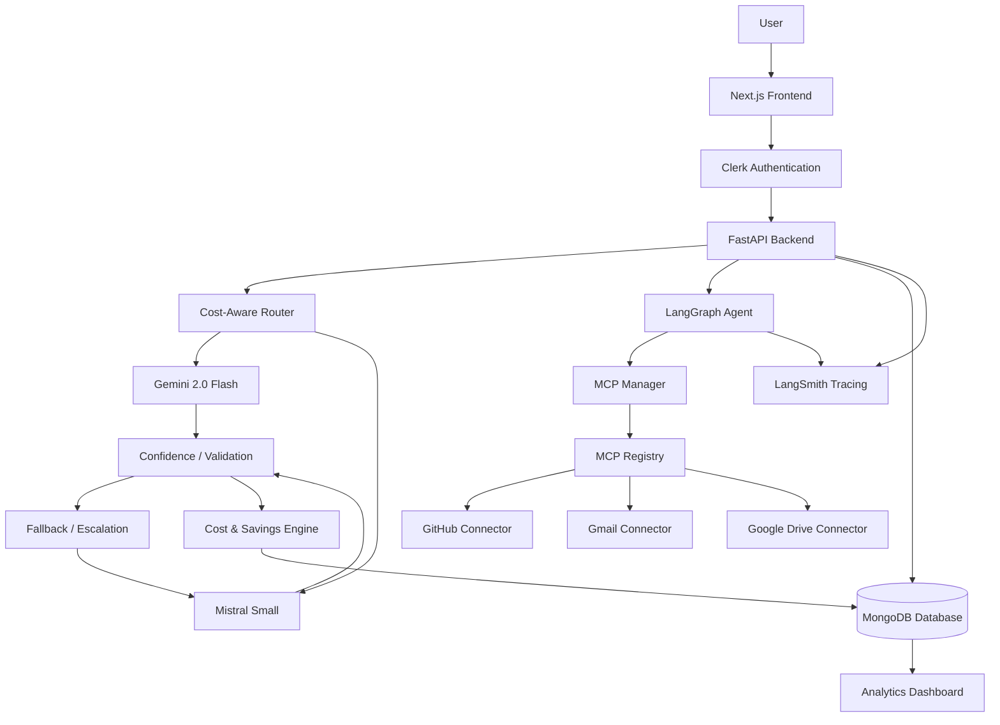

# 🏗️ Cost-Aware Multi-Model Router — System Architecture

> **Technical Architecture Reference Guide for the Cost-Aware Multi-Model Router platform.**

---

## 1. System Architecture Overview

The **Cost-Aware Multi-Model Router** is designed as a modular, decoupled microservice architecture balancing **cost efficiency, output quality, user isolation, and multi-model capability**.



---

## 2. Component Responsibilities

| Component | Technology | Primary Responsibility |
| :--- | :--- | :--- |
| **Frontend UI** | Next.js 16 (App Router), TypeScript, Vanilla CSS | Renders interactive dashboard, router execution form, agent sandbox, connector management UI, and profile settings. |
| **Authentication Provider** | Clerk Identity Service | Manages user registration, sign-in, session cookies, and issues signed JWT tokens (`RS256`). |
| **API Server & Gateway** | FastAPI, Uvicorn, Python 3.12 | Exposes REST APIs, enforces Clerk JWT authentication, manages CORS, handles routing & agent requests. |
| **Database Persistence Layer** | MongoDB, PyMongo 4.x | Stores user profiles & preferences (`users`), MCP connector states (`connectors`), and execution logs/cost metrics (`usage_events`). |
| **Dynamic AI Router** | LangChain, LangGraph | Evaluates prompt complexity and intent to route requests dynamically between Gemini and Mistral. |
| **Primary LLM Provider** | Gemini 2.0 Flash | Handles low-to-medium complexity tasks at minimal cost ($0.75/$3.75 per M tokens). |
| **Escalation / Fallback LLM** | Mistral Small / Medium | Handles complex reasoning tasks and serves as a high-capacity fallback target when primary model confidence fails. |
| **MCP Manager & Registry** | Model Context Protocol SDK | Discovers, registers, and executes user-scoped tools for external services. |
| **Service Connectors** | GitHub, Gmail, Google Drive APIs | Provides user-scoped external integrations for repository listing, email search, and document discovery. |
| **Cost & Savings Engine** | Custom Pydantic & PyMongo logic | Calculates input/output token usage, actual cost, baseline cost comparison, and net financial savings. |
| **Observability Layer** | LangSmith | Provides deep operational tracing, step-by-step agent graph inspection, prompt payload logs, and latency monitoring. |

---

## 3. Backend Architecture (FastAPI)

The backend entry point is [`api_server.py`](file:///k:/multi_model/PROJECT_04_COST_AWARE_ROUTER/api_server.py), constructed on **FastAPI**:

- **Middleware Pipeline**:
  - `CORSMiddleware`: Restricts origins to configured localhost ports and domain origins.
  - `SessionMiddleware`: Signed encrypted session cookies (`SESSION_SECRET_KEY`) for temporary OAuth state storage.
- **Lifecycle Management**:
  - `@app.on_event("startup")`: Connects to MongoDB via `MongoManager` connection pool and initializes collection indexes.
  - `@app.on_event("shutdown")`: Closes MongoDB connection pool gracefully.
- **Key API Routes**:
  - `/health`: System and database health status checks.
  - `/api/router/run`: Dispatches user prompts through the cost-aware routing graph.
  - `/api/agent/run`: Executes multi-step autonomous agent tasks using MCP tools.
  - `/api/user/profile`: Retrieves (`GET`) and updates (`PATCH`) user routing preferences.
  - `/api/connectors/*`: Manages user-scoped connector statuses, OAuth authorization flows, and tool execution.
  - `/api/dashboard`, `/api/analytics`, `/api/logs`, `/api/traces`: Serves aggregated metrics and execution logs.

---

## 4. Frontend Architecture (Next.js 16)

Located in [`frontend-next/`](file:///k:/multi_model/PROJECT_04_COST_AWARE_ROUTER/frontend-next):

- **Framework**: Next.js 16 App Router (`src/app/`).
- **Authentication Wrapper**: `@clerk/nextjs` middleware and components (`<SignIn />`, `<SignUp />`, `<UserButton />`).
- **State Management & Data Fetching**: Client-side fetch API configured with automatic Bearer token injection from Clerk session (`getToken()`).
- **Core Pages**:
  - `/router`: Interactive multi-model prompt execution interface.
  - `/connectors`: OAuth connector management for GitHub, Gmail, Google Drive.
  - `/analytics` / `/history` / `/logs`: Observability dashboards rendering model distributions, cost metrics, and savings.
  - `/settings`: User routing preferences configuration.

---

## 5. AI Routing & Model Architecture

The router intelligently optimizes LLM usage using a multi-phase evaluation strategy:

1. **Complexity Analysis**:
   - Analyzes prompt length, task classification (summarization, extraction, classification, coding, QA), structural constraints, and reasoning depth.
   - Computes a normalized complexity score `[0.0, 1.0]`.
2. **Model Assignment Policy**:
   - **Low/Medium Complexity** (`complexity <= COMPLEXITY_THRESHOLD`): Assigned to **Gemini 2.0 Flash**.
   - **High Complexity** (`complexity > COMPLEXITY_THRESHOLD`): Assigned directly to **Mistral Small**.
3. **Execution & Response Validation**:
   - Dispatches prompt to target model and parses output.
   - Evaluates response against deterministic validation criteria (JSON/Pydantic structure, non-empty response, completeness heuristic).
4. **Confidence Scoring & Escalation**:
   - Calculates a confidence score `[0.0, 1.0]`.
   - If confidence is below `CONFIDENCE_THRESHOLD` (default `0.75`) or if Gemini returns a provider failure/rate limit, the system automatically escalates to **Mistral Small**.

---

## 6. Model Context Protocol (MCP) Architecture

The platform implements the **Model Context Protocol (MCP)** specification:

- **`MCPManager`** (`app/mcp/manager.py`): Centralized registry managing active tool servers per provider.
- **`MCPClient`** (`app/mcp/client.py`): Client abstraction managing server connections, tool discovery (`list_tools()`), and execution (`call_tool()`).
- **Supported Connectors**:
  - **GitHub Connector** (`app/mcp/connectors/github.py`): `list_my_repositories`, `get_repository_details`, `list_issues`, `search_code`.
  - **Gmail Connector** (`app/mcp/connectors/gmail.py`): `search_emails`, `read_email_thread`, `draft_email`.
  - **Google Drive Connector** (`app/mcp/connectors/google_drive.py`): `search_files`, `read_file_content`, `list_recent_files`.
- **Transports**:
  - `OAuthTransport` / `GitHubOAuthTransport` / `GmailOAuthTransport` / `GoogleDriveOAuthTransport`: Real OAuth user-authenticated transports.
  - `InMemoryMCPTransport`: Fallback mock transport for development and testing.

---

## 7. LangGraph Agent Architecture

Autonomous multi-step workflows execute inside a **LangGraph State Machine** (`app/router/agent_graph.py`):

```
State Input
   ↓
[Plan & Select Tools Node]
   ↓
[Execute MCP Tools Node] (GitHub / Gmail / Google Drive)
   ↓
[Observe & Synthesize Response Node]
   ↓
[Confidence & Output Validation Node]
   ├── Pass → [Final State Output]
   └── Fail / Low Confidence → [Escalate Model & Retry Node]
```

- State consists of `query`, `user_id`, `tools_used`, `steps`, `tool_results`, `answer`, `confidence`, `actual_cost`, `baseline_cost`, `savings`, and `status`.

---

## 8. Authentication & Identity Architecture

- **Identity Provider**: Clerk.
- **Verification Mechanism**: [`app/auth/clerk.py`](file:///k:/multi_model/PROJECT_04_COST_AWARE_ROUTER/app/auth/clerk.py) verifies incoming HTTP `Authorization: Bearer <token>` headers.
- **JWKS Verification**: Downloads and caches Clerk public keys using `jwt.PyJWKClient(jwks_url)` and decodes JWT using `RS256` algorithm.
- **User Identity Claims**: Extracts `sub` (or `user_id`) as the immutable `clerk_user_id`.
- **Automatic User Upsert**: Upon successful JWT validation, the system triggers `UserRepository.upsert_user(clerk_user_id, identity_data)` to ensure the user exists in MongoDB.

---

## 9. MongoDB Database Architecture

The persistence layer (`app/db/`) uses **MongoDB** via PyMongo:

- **Connection Manager** (`app/db/mongodb.py`):
  - Singleton `MongoManager` connection pool (`maxPoolSize=50`).
  - Connection timeouts (`serverSelectionTimeoutMS=2000`) ensuring offline DB states never hang API requests.
- **Collections & Schemas**:
  1. **`users`**: Stores user identity details (`clerk_user_id`, `email`, `first_name`, `last_name`, `full_name`, `image_url`) and user preferences (`default_model`, `confidence_threshold`, `complexity_threshold`).
     - *Index*: `clerk_user_id` (UNIQUE).
  2. **`connectors`**: Stores user-scoped MCP connector connection status and account metadata (`login`, `avatar_url`, `email`).
     - *Index*: `(clerk_user_id, provider)` (UNIQUE).
  3. **`usage_events`**: Stores request logs, token usage, actual cost, baseline cost, savings, and tool executions.
     - *Indexes*: `(clerk_user_id, created_at)`, `request_id`.
- **Aggregation Pipelines**: Computes user-scoped metrics (`total_requests`, `gemini_requests`, `mistral_requests`, `escalation_rate`, `average_confidence`, `total_cost`, `baseline_cost`, `total_savings`, `savings_percentage`).

---

## 10. Cost, Savings & Observability Architecture

- **Token Cost Accounting**:
  - Gemini 2.0 Flash: $0.75 / M input tokens, $3.75 / M output tokens.
  - Mistral Small: $0.50 / M input tokens, $1.50 / M output tokens.
- **Baseline & Savings Calculation**:
  - Baseline cost represents execution on a high-tier baseline model.
  - Financial Savings = `max(0, baseline_cost - actual_cost)`.
  - Savings Percentage = `(savings / baseline_cost) * 100`.
- **LangSmith Tracing**:
  - Captures full trace graphs for router runs and agent executions when `LANGSMITH_TRACING=true`.

---

## 11. Security Boundaries & Data Isolation

- **Backend Identity Resolution**: The frontend never supplies user IDs for database access. All queries filter strictly by `clerk_user_id` derived from verified JWT tokens.
- **User Data Isolation**: Every MongoDB query on `users`, `connectors`, and `usage_events` includes `clerk_user_id`. User A can never inspect or alter User B's data.
- **Credential Protection**:
  - `MONGODB_URI`, `CLERK_SECRET_KEY`, and LLM API keys are kept in server-side environment variables and never exposed to Next.js or `NEXT_PUBLIC_*` variables.
  - OAuth access and refresh tokens are never stored in plain text or returned in API responses.
