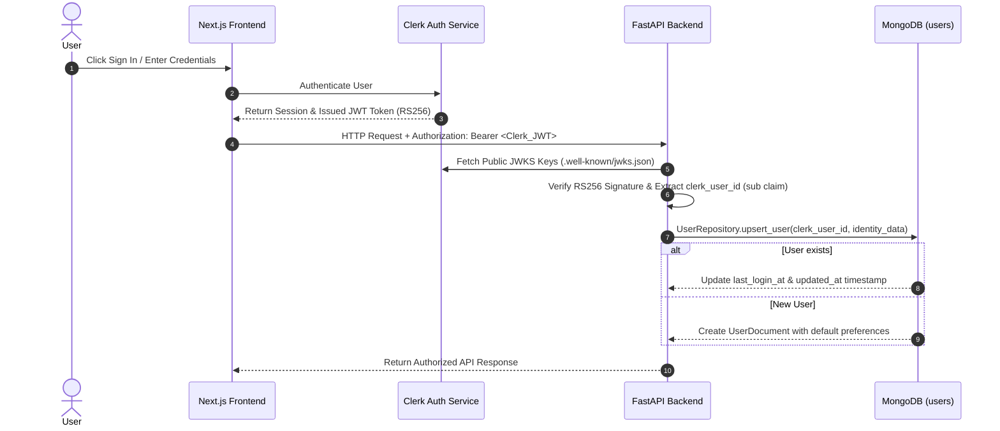
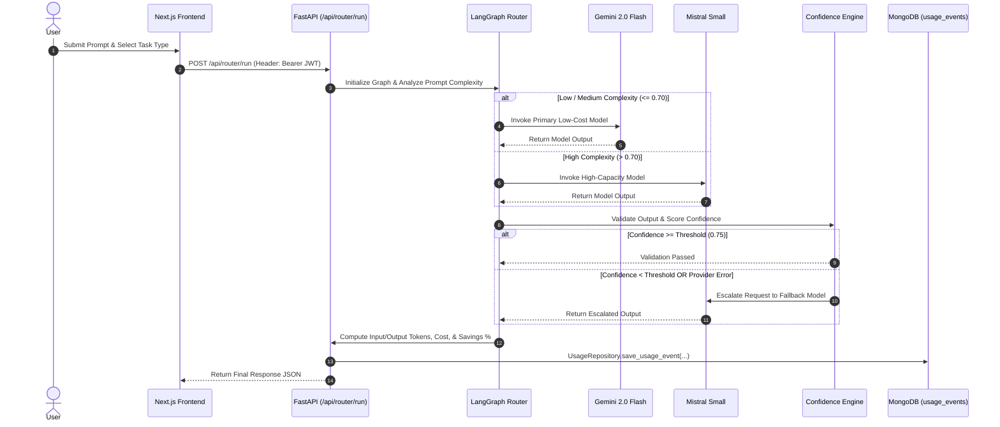
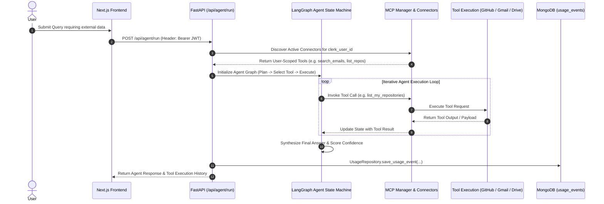
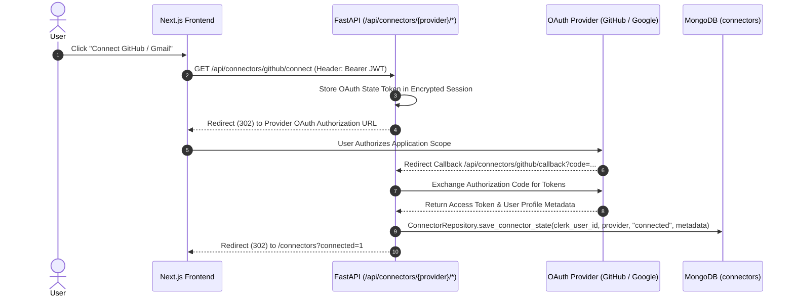
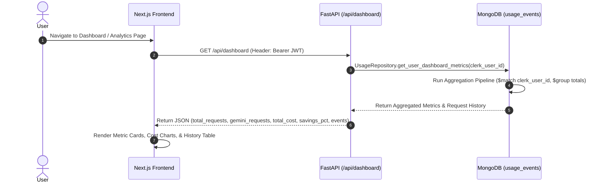
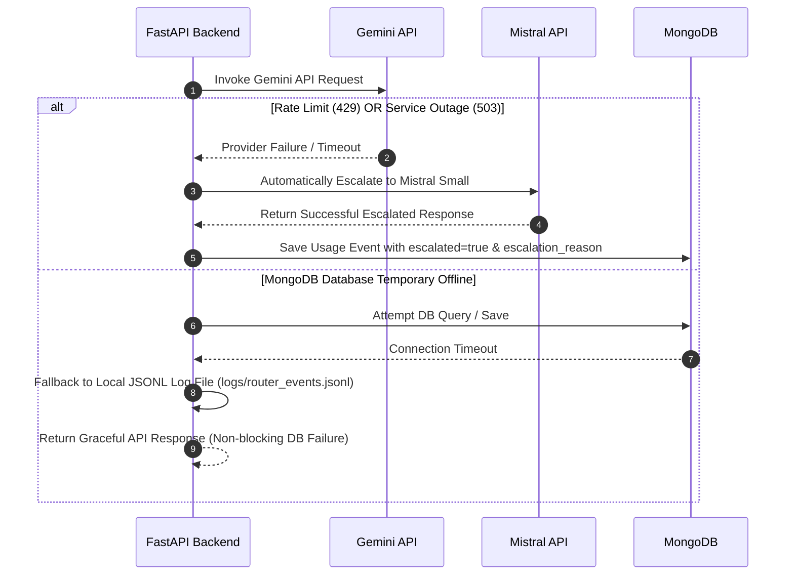

# 🔄 Cost-Aware Multi-Model Router — System Workflows

> **Comprehensive operational and execution workflow guide for the Cost-Aware Multi-Model Router platform.**

---

## 1. User Authentication & Identity Workflow

This workflow describes how user authentication and identity propagation occur from the Next.js frontend to the FastAPI backend and MongoDB persistence layer.

### Detailed Steps:
1. **User Sign-In**: The user accesses `/sign-in` rendered by `@clerk/nextjs`.
2. **JWT Issuance**: Upon authentication, Clerk issues a signed JWT token (`RS256`).
3. **API Dispatch**: The Next.js frontend attaches the token to API requests in the `Authorization: Bearer <token>` header.
4. **JWT Verification**: `app/auth/clerk.py` decodes the token using Clerk's public key retrieved from `CLERK_JWKS_URL`.
5. **Identity Extraction**: The immutable `sub` claim is extracted as `clerk_user_id`.
6. **Automatic User Upsert**: `UserRepository.upsert_user` checks MongoDB `users` collection. If the user exists, `last_login_at` is updated; if not, a new `UserDocument` is created.

---

## 2. Cost-Aware Router Execution Workflow

This workflow details how user prompts are analyzed, routed, executed, validated, escalated, and logged.

### Detailed Steps:
1. **Request Submission**: User submits prompt and task type (e.g. `summarization`, `classification`, `extraction`).
2. **Complexity Analysis**: Router calculates input length, structure, and intent complexity score `[0.0, 1.0]`.
3. **Primary Model Dispatch**:
   - `complexity <= 0.70`: Request dispatched to **Gemini 2.0 Flash**.
   - `complexity > 0.70`: Request dispatched directly to **Mistral Small**.
4. **Confidence Evaluation**: Response is evaluated for structural completeness, schema validity, and confidence heuristics.
5. **Conditional Escalation**: If Gemini output scores below confidence threshold (`0.75`) or fails due to rate limits/errors, the query transparently escalates to **Mistral Small**.
6. **Cost & Savings Accounting**: System calculates actual execution cost against baseline, generating net savings (`baseline_cost - actual_cost`).
7. **MongoDB Logging**: `UsageRepository.save_usage_event` persists the request record to MongoDB `usage_events`.

---

## 3. MCP Tool & Autonomous Agent Workflow

This workflow describes multi-step task execution using Model Context Protocol (MCP) tools and LangGraph state management.

### Detailed Steps:
1. **Query Submission**: User inputs an agent query (e.g. *"Search my Gmail for project alerts and check open GitHub issues"*).
2. **Tool Discovery**: `MCPManager` retrieves active connectors registered for `clerk_user_id`.
3. **State Machine Loop**: LangGraph executes an iterative cycle:
   - **Plan**: Analyze query intent and state history.
   - **Select Tool**: Select required MCP tool (`list_my_repositories`, `search_emails`, `search_files`).
   - **Execute**: Invoke tool with validated parameters.
   - **Observe**: Capture tool output and append to graph state.
4. **Synthesis & Logging**: Agent synthesizes final natural language response and saves execution event to MongoDB `usage_events`.

---

## 4. OAuth & Connector Management Workflow

This workflow details how external user accounts (GitHub, Gmail, Google Drive) are connected, stored in MongoDB, and isolated per user.

### Detailed Steps:
1. **Connect Trigger**: User clicks "Connect" on `/connectors` page.
2. **OAuth Authorization**: FastAPI generates a secure state token and redirects user to provider authorization page.
3. **User Consent**: User authorizes application permissions (e.g. `read:user repo` or `gmail.readonly`).
4. **Code Exchange**: Provider redirects to callback endpoint; FastAPI exchanges authorization code for tokens and user metadata (`login`, `email`, `avatar_url`).
5. **MongoDB Persistence**: `ConnectorRepository.save_connector_state` records connector status in MongoDB `connectors` collection bound strictly to `clerk_user_id`.
6. **User Isolation**: Disconnect requests (`POST /api/connectors/{provider}/disconnect`) update the specific user's status without affecting other users.

---

## 5. Dashboard & Cost Analytics Workflow

This workflow details how financial analytics, cost distributions, and request metrics are calculated and rendered.

### Detailed Steps:
1. **Dashboard Navigation**: User visits `/analytics` or `/history`.
2. **Metrics Query**: Frontend requests `GET /api/dashboard` with Clerk Bearer token.
3. **MongoDB Aggregation Pipeline**: `UsageRepository.get_user_dashboard_metrics` executes:
   - `$match`: Filters `usage_events` by `clerk_user_id`.
   - `$group`: Sums `total_requests`, `gemini_requests`, `mistral_requests`, `escalations`, `total_actual_cost`, `total_baseline_cost`, `total_savings`.
4. **Data Rendering**: Next.js renders financial KPI cards (Total Savings, Savings %, Model Ratio) and request history table.

---

## 6. Failure Handling & Resilience Workflow

This workflow describes system recovery when encountering provider rate limits, model failures, or temporary database outages.

### Resilience Guarantees:
- **Automatic Model Escalation**: Gemini rate limits (429) or timeouts trigger immediate fallback to Mistral Small.
- **Database Fault Tolerance**: Short MongoDB connection timeouts (`2000ms`) prevent API hangs. If MongoDB is offline, operations fallback gracefully or return structured `DATABASE_UNAVAILABLE` error payloads without crashing the server.
